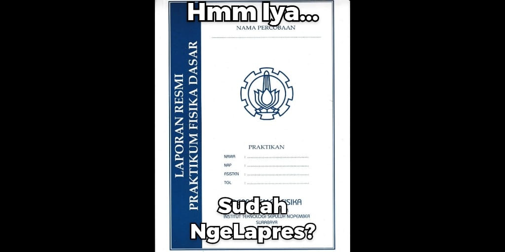

# LayzLaprak - Advanced Handwriting Synthesis System

A comprehensive implementation of handwriting synthesis based on Alex Graves' paper ["Generating Sequences with Recurrent Neural Networks"](https://arxiv.org/abs/1308.0850), enhanced with modern features including web-based editing, markup support, flexible document layouts, and real-time preview capabilities.

## Features

### Core Handwriting Synthesis
- **RNN-based Generation**: Long Short-Term Memory (LSTM) networks for natural handwriting synthesis
- **Style Control**: Adjustable bias and style parameters for varied handwriting characteristics
- **Word-level Customization**: Individual word regeneration with custom parameters
- **Multiple Writing Styles**: Support for different handwriting styles and characteristics

### Advanced Document Processing
- **Markup Language**: Rich markup system for document structure and styling
- **Flexible Layouts**: Configurable margins, alignments, and page layouts
- **Multi-page Support**: Automatic page breaks and continuation
- **Text Styles**: Predefined styles (title, heading, body) with custom formatting

### Web Interface
- **Real-time Editor**: Live markup editing with syntax highlighting
- **Document Preview**: Instant preview of document structure and formatting
- **SVG Viewer**: Built-in viewer for generated handwriting documents
- **Progress Tracking**: Real-time synthesis progress with WebSocket updates

### Document Management
- **Template System**: Built-in templates for common document types
- **File Management**: Browse, view, and download generated documents
- **Metadata Tracking**: Comprehensive document metadata and statistics
- **Export Options**: SVG and downloadable formats

## Quick Start

### Prerequisites
- Python 3.8+
- TensorFlow 2.x
- Flask and Flask-SocketIO
- NumPy, Matplotlib, and other scientific libraries

### Installation

1. **Clone the repository**
   ```bash
   git clone https://github.com/hanzamzamy/LazyLaprak.git
   cd LazyLaprak
   ```

2. **Install dependencies**
   ```bash
   pip install -r requirements.txt
   ```

3. **Download pre-trained models**
   ```bash
   # Place your pre-trained checkpoint files in the checkpoints/ directory
   mkdir checkpoints
   # Copy your model files here
   ```

4. **Run the web interface**
   ```bash
   python handwriting_synthesizer.py --web
   ```

5. **Access the application**
   - Open your browser to `http://localhost:5000`
   - Start creating handwritten documents!

## Usage Guide

### Web Interface

#### Document Editor
1. **Open the editor** at `http://localhost:5000`
2. **Write markup text** using the built-in markup language
3. **Preview in real-time** to see document structure
4. **Synthesize** to generate handwritten version
5. **View and download** the generated SVG document

#### Markup Language

The system supports a rich markup language for document formatting:

**Text Styles:**
```
[style:title]Document Title[/style]
[style:heading1]Chapter Title[/style]
[style:body]Regular body text[/style]
```

**Text Alignment:**
```
[align:left]Left-aligned text[/align]
[align:center]Centered text[/align]
[align:right]Right-aligned text[/align]
[align:justify]Justified text with even spacing[/align]
```

**Custom Parameters:**
```
[bias:2.5]Text with custom bias for handwriting variation[/bias]
[word:bias=1.5,style=10]custom[/word] - Individual word styling
```

**Page Control:**
```
[page-break] - Force new page
[line-break] - Force new line
[margin:odd_left=4.0,even_right=3.0]Custom margins[/margin]
```

#### Word Regeneration
1. **Click on any word** in the preview panel
2. **Generate multiple versions** with different parameters
3. **Select preferred version** to update the document
4. **Re-synthesize** to apply changes to the full document

### Command Line Interface

**Basic synthesis:**
```bash
python handwriting_synthesizer.py --input document.txt --output my_document
```

**Custom parameters:**
```bash
python handwriting_synthesizer.py \
    --input document.txt \
    --output my_document \
    --checkpoint-dir /path/to/models
```

### Templates

The system includes several built-in templates:

- **Simple Test**: Basic document for testing functionality
- **Formal Letter**: Professional business letter format
- **Margin Test**: Demonstrates flexible margin system
- **Markup Demo**: Comprehensive markup feature showcase

## Architecture

### Core Components

```
LazyLaprak/
├── core/
│   ├── config.py           # Configuration and style definitions
│   ├── handwriting_engine.py  # RNN-based handwriting generation
│   ├── text_processor.py   # Text parsing and processing
│   └── document_renderer.py   # SVG document generation
├── templates/
│   ├── editor.html         # Main web editor interface
│   └── viewer.html         # Document viewer interface
├── output/                 # Generated documents
├── checkpoints/           # Pre-trained model files
└── handwriting_synthesizer.py  # Main application
```

### Key Classes

- **`AdvancedHandwritingSynthesizer`**: Main synthesis orchestrator
- **`HandwritingEngine`**: Core RNN-based text generation
- **`EnhancedMarkupProcessor`**: Markup language parser
- **`DocumentRenderer`**: SVG generation and layout
- **`WordRegenerationManager`**: Word-level customization

## Configuration

### Document Settings
```python
# core/config.py
document_config = DocumentConfig(
    page_width=21.0,      # A4 width in cm
    page_height=29.7,     # A4 height in cm
    line_height=1.2,      # Line spacing
    num_lines=25          # Lines per page
)
```

### Style Definitions
```python
PREDEFINED_STYLES = {
    'title': TextStyle(
        font_size=24,
        bias=2.0,
        scale=1.5,
        alignment=TextAlignment.CENTER
    ),
    'body': TextStyle(
        font_size=16,
        bias=1.8,
        scale=1.0,
        alignment=TextAlignment.LEFT
    )
}
```

### Margin Control
```python
margins = PageMargins(
    odd_left=4.0,    # Wider left margin for binding
    odd_right=3.0,
    even_left=3.0,   # Mirrored for even pages
    even_right=4.0,
    top=3.0,
    bottom=3.3
)
```

## Advanced Features

### Real-time Editing
- WebSocket-based progress updates
- Live document preview

### Flexible Page Layout
- Odd/even page margin support
- Automatic text area calculation
- Custom margin override system

### Word-level Customization
- Individual word parameter tuning
- Multiple generation attempts
- Version comparison and selection

### Export and Integration
- SVG output for scalability
- Metadata preservation
- Batch processing support

## API Reference

### REST Endpoints

| Endpoint | Method | Description |
|----------|--------|-------------|
| `/api/preview` | POST | Generate document preview |
| `/api/synthesize` | POST | Start document synthesis |
| `/api/regenerate_word` | POST | Generate word variations |
| `/api/apply_word_regeneration` | POST | Apply word changes |
| `/api/documents` | GET | List generated documents |
| `/api/download/<filename>` | GET | Download document |

### WebSocket Events

| Event | Direction | Description |
|-------|-----------|-------------|
| `synthesis_update` | Server→Client | Progress updates |
| `connect` | Client→Server | Connection established |

## Troubleshooting

### Common Issues

**Indefinite loading/progress bar issues**
- Check WebSocket connection
- Verify task ID tracking
- Review browser console for errors

**Markup not rendering properly**
- Verify markup syntax
- Check for unmatched tags
- Use templates as reference

### Performance Optimization

1. **Model Loading**: Pre-load models at startup
2. **Caching**: Enable stroke caching for repeated words
3. **Memory**: Monitor memory usage for large documents
4. **Concurrency**: Limit concurrent synthesis tasks

## Examples

### Basic Document
```markup
[style:title]My First Document[/style]

[style:body]This is a simple document demonstrating 
the handwriting synthesis system.[/style]

[align:center]Thank you for reading![/align]
```

### Complex Layout
```markup
[style:title]Research Paper[/style]

[style:heading1]Abstract[/style]
[style:body]This paper presents...[/style]

[page-break]

[style:heading1]Introduction[/style]
[style:body]In recent years, [word:bias=1.5]machine[/word] 
learning has evolved significantly.[/style]

[margin:odd_left=5.0]
[style:body]This section uses custom margins for 
better readability.[/style]
[/margin]
```

## Contributing

1. Fork the repository
2. Create a feature branch
3. Make your changes
4. Add tests if applicable
5. Submit a pull request

## License

This project is licensed under the MIT License - see the [LICENSE](LICENSE) file for details.

## Acknowledgments

- **Alex Graves** for the original research and paper
- **Sean Vasquez** for the [initial implementation](https://github.com/sjvasquez/handwriting-synthesis)

---

**LazyLaprak** - Akan kami usahakan hingga laprak tulis tangan hilang dari muka bumi.